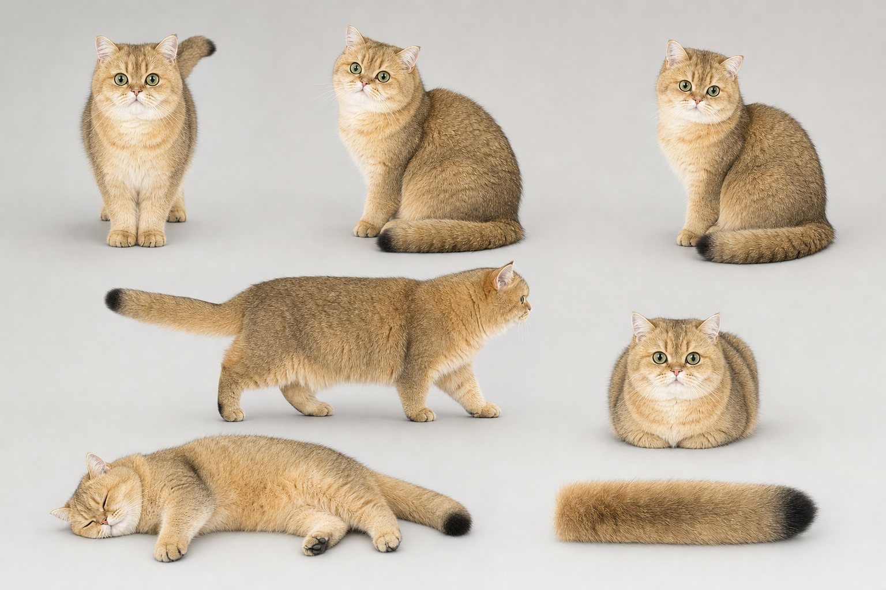

# 豆花 / DouhuaPet

一款写实、安静、离线的原生 macOS 桌面宠物。应用使用 AppKit 透明非激活浮动面板承载 SpriteKit，主视觉由硬件解码的透明 HEVC 视频驱动，不需要网络、账号、第三方运行时或额外系统权限。



## 像素桌宠 Demo

独立的 `DouhuaPixelDemo.app` 已更新到 0.11.0。慢走、短跑和窗口顶边行走均改为“真实位移驱动步态”：地面慢走为 16 pt/s、每 28 pt 完成一个步态循环；短跑为 42 pt/s、每 40 pt 一循环；窗口慢走为 12 pt/s。只有豆花自己走出的距离会推进四肢，窗口被拖动时不会误计为步幅，因此不再出现原地踏步、滑步或“腿慢身体快”。

自动模式现在会先安静观察 12–22 秒，再低频选择短距离地面慢走、偶尔短跑/跳跃、跳上可见窗口、沿窗口顶边慢走，或跳到另一个窗口。跑步和跨窗口跳跃权重显著低于慢走与安静驻留，不会频繁绕屏。

菜单选择“跳到当前窗口”后，豆花会沿连续抛物线跳上最前方窗口顶边，缓冲落地后屈后腿坐稳，并在窗口移动或缩放时保持脚底贴边；坐稳后点击豆花，会触发低头、肩肘腕连续下探、轻拍窗口边缘再收爪。窗口关闭、最小化或选择“从窗口回到地面”时，豆花会自然起身并跳回地面。

窗口互动只使用 CoreGraphics 读取可见窗口的编号、所属进程和几何边界，不读取屏幕像素或窗口内容，不申请录屏和辅助功能权限。也可以把豆花拖到任意窗口顶边附近，松手后它会自动贴边坐下。

构建并安装：

```sh
Scripts/build-pixel-demo.sh
open ~/Applications/DouhuaPixelDemo.app
```

也可直接启动窗口互动验收：

```sh
open ~/Applications/DouhuaPixelDemo.app --args --action=window
```

## 当前版本

0.5.1 已停用“多张 PNG 精灵快速切换”作为主渲染方式。当前画面来自同一段真实豆花视频：macOS Vision 逐帧生成前景 alpha，再以固定参考纹理配准消除手持镜头平移，最后编码为 480×440、30fps 的 HEVC-with-alpha 视频。运行时由 `AVQueuePlayer + AVPlayerLooper + SKVideoNode` 持续播放，不再由 Swift 逐张加载、切换动作图片。

当前主循环长 10.13 秒、共 304 个连续时间样本，包含真实的呼吸、眼神、转头、耳朵和尾巴微动。循环终点从后半段中选择与起始姿势最接近的落点，避免黑帧、曝光闪烁和整只猫换形。

3D 扩展层已建立：App 启动时优先加载 `douhua_rigged.usdz`，校验标准猫科骨骼后由 SceneKit 和程序化四拍步态、呼吸、起卧、睡眠、摆尾与摸头反应驱动。正式 USDZ 资产未交付前，会安全回退到上述已防抖真实视频，不显示临时玩具模型。完整资产合同见 `Docs/Douhua3DProductionSpec.md`。

桌宠当前支持：

- 透明、无边框、非激活、置顶窗口，加入所有 Spaces 和普通全屏空间。
- 持续 30fps 真实豆花前景；没有视觉上的 PNG 帧切换。
- 透明区域穿透点击；超过 4 pt 才进入拖动。
- 拖动、暂停、隐藏或系统休眠时同步暂停视频时间轴，恢复后继续。
- 菜单栏和右键菜单保留召回、暂停、显隐、体型、位置重置和退出。
- 使用 UserDefaults 保存体型、模式、屏幕和归一化位置。
- 处理显示器变化与睡眠/唤醒；隐藏时停止播放与定时器。

## 为什么暂时不走动

现有原始素材没有“固定机位、全身无遮挡、完整步态”的豆花片段。让趴着的真猫在屏幕上横向滑行，或重新换回生成图片步态，都会破坏“像活猫”这个最高优先级。因此 0.5.1 先保留已防抖的真实连续休息，待正式 3D 骨骼豆花通过验收后再恢复巡视。

## 构建、测试与运行

要求 macOS 14+、Apple Silicon、Swift 6.2+ Command Line Tools 与 FFmpeg。从本目录执行：

```sh
Scripts/test-logic.sh
swift build -Xswiftc -warnings-as-errors
swift test
Scripts/build-app.sh
Scripts/run-app.sh
```

重建透明视频资产：

```sh
Scripts/build-live-video.sh
```

正式 3D 模型到位后的合同校验：

```sh
xcrun swift Scripts/ValidateDouhuaRig.swift \
  Sources/DouhuaPet/Resources/Models/Douhua/v1/douhua-rig-v1.json \
  Sources/DouhuaPet/Resources/Models/Douhua/v1/douhua_rigged.usdz
```

生成并安装的应用位于 `~/Applications/DouhuaPet.app`，可归档包位于 `.build/DouhuaPet.app.zip`。构建脚本会执行 ad-hoc 签名与严格签名验证。

## 资产和隐私

运行资产位于 `Sources/DouhuaPet/Resources/Animations/Douhua/v5-live/`：

- `douhua_live_idle.mov`：已去背景、去声音、缩放和重新编码的透明派生片段。
- `douhua_live_hit.png`：仅用于点击命中判定，不作为画面播放帧。

原始照片和原始视频不打包进 App；应用运行时不联网、无遥测、无分析 SDK，不申请 Accessibility、Input Monitoring、Screen Recording、摄像头或麦克风权限。以前的 v2/v3/v4 PNG 动画均已移入 `Docs/Art/AnimationSource/archive/`，不进入运行包。

## 已知限制

- 当前安装包还没有正式绑定 USDZ，因此由已防抖真实视频回退层显示；3D 运行时和动作驱动器已编译进 App。
- 循环落点已按姿态差最小选取，但仍是真实非摆拍镜头，不是数学上完全相同的首尾帧。
- 当前为主人本机自用的 ad-hoc 签名版本，未做 Developer ID 公证。

产品范围和验收标准见 `Docs/PRD.md`。
